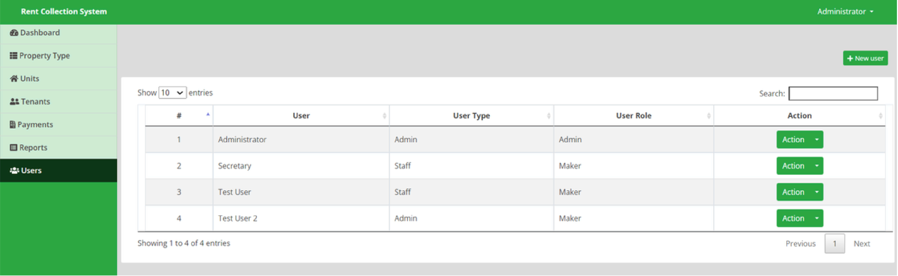

# RentPro User Guide
Welcome to the RentPro User Guide. This document provides step-by-step instructions for using the RentPro system.

## Table of Contents
1. [Dashboard](#dashboard)
2. [Property Module](#property-module)
3. [Units Module](#units-module)
4. [Tenants Module](#tenants-module)
5. [Payments Module](#payments-module)
6. [Accounting Module](#accounting-module)
7. [Reports Module](#reports-module)

## Dashboard
The system features a simple and intuitive dashboard that provides users with an at-aglance view of key metrics. Instantly access the total number of houses, current tenants, and
monthly rent payments. This real-time data helps property managers stay informed and make
quick decisions, all from a single, user-friendly interface.

### Steps to Access the Dashboard
1. Log in to RentPro.
2. Click on the **Dashboard** tab in the navigation bar.
3. View the summary of houses, tenants and payments.

## Property Module
The Property/Category module allows users to effortlessly add and manage property
details. Users can quickly input the name of an apartment block and assign the
corresponding landlord. This feature ensures accurate property tracking and streamlined
management of multiple properties under different landlords, all within one platform.

### Steps to Access the Property Module
1. Log in to RentPro.
2. Click on the **Property Type** tab in the navigation bar.
3. Enter the name of the Property and the Landlord name.
4. Click **Save**.

## Units Module
The Units Module allows users to easily add house units and assign them to the appropriate
apartment block. Users can input detailed information for each unit, including a house
description, rent amount, and occupancy status (vacant or occupied). The system
automatically updates the status to "occupied" when a tenant is added. Additionally, users
can bulk import multiple house units at once, making it ideal for large-scale property management. This module simplifies the management of multiple units, ensuring accuracy
and efficiency.

### Steps to Access the Units Module
1. Log in to RentPro.
2. Click on the **Units** tab in the navigation bar.
3. Enter the House No, Category/Property Name.
4. Enter the Rent Amount, Status(Vacant).
5. Click **Save**.

### Workflow

## Tenants Module
In the Tenants module of the system, users can efficiently manage tenant details and link
them to the correct apartment block and house number. Once a tenant is added, the system
generates a pre-filled Tenancy Lease Agreement, which is available as a downloadable PDF.
Users can also upload signed agreements into the system, which can be viewed later by
clicking the 'View Agreement' button.
Additionally, the module includes a feature to vacate tenants. When a tenant is vacated,
users can log repair items, input repair costs, and note the deposit amount paid back, along
with the reference number for the refund. All these actions are documented and compiled in
the Vacated Tenants Report for future reference.

### Steps to Access the Units Module
1. Log in to RentPro.
2. Click on the **Tenants** tab in the navigation bar.
3. Click **New Tenant** button
3. Enter the tenant details
4. Select apartment
5. Select the House Number from the list.
6. Click **Save**.
7. Click **Generate Agreement** to view the agreement that is automatically created.

## Workflow

## Payments Module
In the Payments module, users can efficiently handle tenant payments such as deposits, rent,
and service charges. The system calculates the tenant's balance based on the house rent and
allows users to reconcile payments with bank or MPESA statements. When reconciling, the
system records the 'Statement Amount', calculates the Actual Balance, and includes any
arrears from previous months. It also generates a detailed receipt containing tenant
information, apartment name, house number, rent amount, service charges, and monthly
arrears, with the receipt available for download in PDF format.
Before processing rental payments, users can also generate and send an invoice to tenants in
PDF form, making it easier to manage payment collection.

### Steps to Access the Payments Module
1. Log in to RentPro.
2. Click on the **Payments** tab in the navigation bar.
3. View payments that have been made by tenants

## Accounting
The Accounting Module streamlines financial tracking and reporting for rental management.
It includes:
Financial/Accounting Reports
Chart of Accounts: Provides an organized list of all accounts (assets, liabilities, income,
expenses) mapped to rental transactions, facilitating accurate and efficient recordkeeping.
Journal Entries: Enables recording of various financial transactions in a double-entry
format to ensure accurate account balancing.

### Steps to Access the Accounting Module
1. Log in to RentPro.
2. Click on the **Accounting** tab in the navigation bar.
3. Click on the **Chart of Accounts** tab
4. Create the Chart of Accounts
5. Click on **Journal Entries** 
6. Create journal entries.

## Financial/Accounting Reports
**Balance Sheet:** Summarizes assets, liabilities, and equity to show the system’s financial
position.

### Steps to Access the Balance Sheet
1. Log in to RentPro.
2. Click on the **Reports** tab in the navigation bar.
3. Click on the **Accounting Reports**
4. Click on **Balance Sheet**

**Trial Balance:** Lists all account balances to verify ledger accuracy.

### Steps to Access the Trial Balance
1. Log in to RentPro.
2. Click on the **Reports** tab in the navigation bar.
3. Click on the **Accounting Reports**
4. Click on **Trial Balance**

**Profit and Loss Statement:** Reports income and expenses over a specific period to assess
profitability.

### Steps to Access the Trial Balance
1. Log in to RentPro.
2. Click on the **Reports** tab in the navigation bar.
3. Click on the **Accounting Reports**
4. Click on **Profit and Loss Statement**

## Reports
In the Reports module, users have access to a variety of detailed reports for effective rent
management and tracking. These reports can be modified depending on the user
requirements. We also allow addition of more reports. Currently, the system contain the
following reports:

**Monthly Payments Report:** Displays monthly rental payments and balances, giving
insights into rent collection over time. The system allows the user to filter the month and
the apartment.

### Steps to Access the Monthly Payments Report
1. Log in to RentPro.
2. Click on the **Reports** tab in the navigation bar.
3. Click on the **Monthly Payments Report**

**Rental Balances Report:** Provides a detailed view of rental payments for all tenants,
outstanding balances as of the report's date, and payment dates, categorized by
apartment.

### Steps to Access the Rental Balances Report
1. Log in to RentPro.
2. Click on the **Reports** tab in the navigation bar.
3. Click on the **Rental Balances Report**

**Landlords Overview Report:** Offers an overview of rental collections for apartments
associated with a specific landlord, facilitating easy landlord management.

### Steps to Access the Landlords Overview Report
1. Log in to RentPro.
2. Click on the **Reports** tab in the navigation bar.
3. Click on the **Landlords Overview Report**

**Vacated Tenants Report:** Captures key information about vacated tenants, including
items requiring repair, repair costs, deposit amounts refunded, and deposit refund
reference numbers for clear documentation and tracking.

### Steps to Access the Vacated Tenants Report
1. Log in to RentPro.
2. Click on the **Reports** tab in the navigation bar.
3. Click on the **Vacated Tenants Report**.

## Users Module
In the Users module, administrators can efficiently manage user accounts by creating new
users and assigning them specific roles based on their responsibilities. This module ensures
that access to the system is controlled and secure, with each user granted permissions
Landlords Overview Report: Offers an overview of rental collections for apartments
associated with a specific landlord, facilitating easy landlord management.
Vacated Tenants Report: Captures key information about vacated tenants, including
items requiring repair, repair costs, deposit amounts refunded, and deposit refund
reference numbers for clear documentation and tracking.tailored to their role. Whether it's a property manager, landlord, or accountant, roles can be
customized to limit or allow access to specific areas and functionalities of the system,
enhancing accountability and operational efficiency.

### Steps to Access the Vacated Tenants Report
1. Log in to RentPro.
2. Click on the **Users** tab in the navigation bar.
3. Click on the **New User** button.

